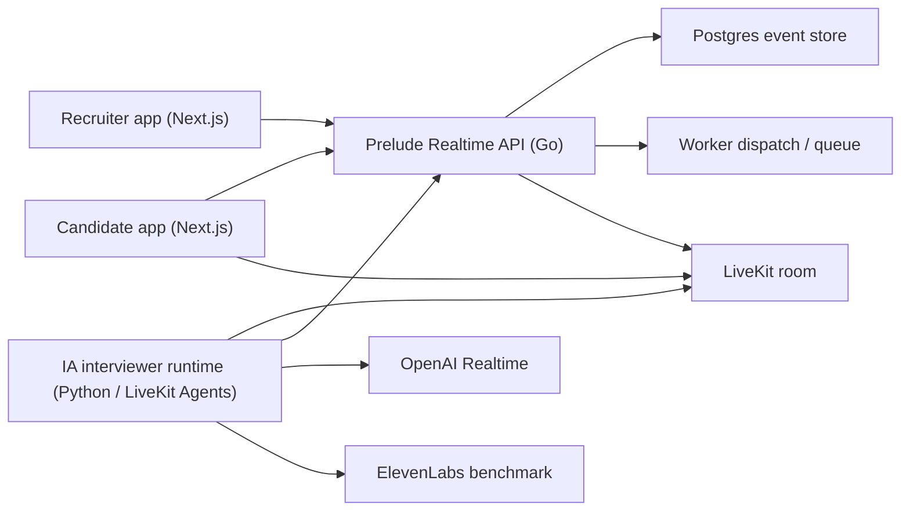
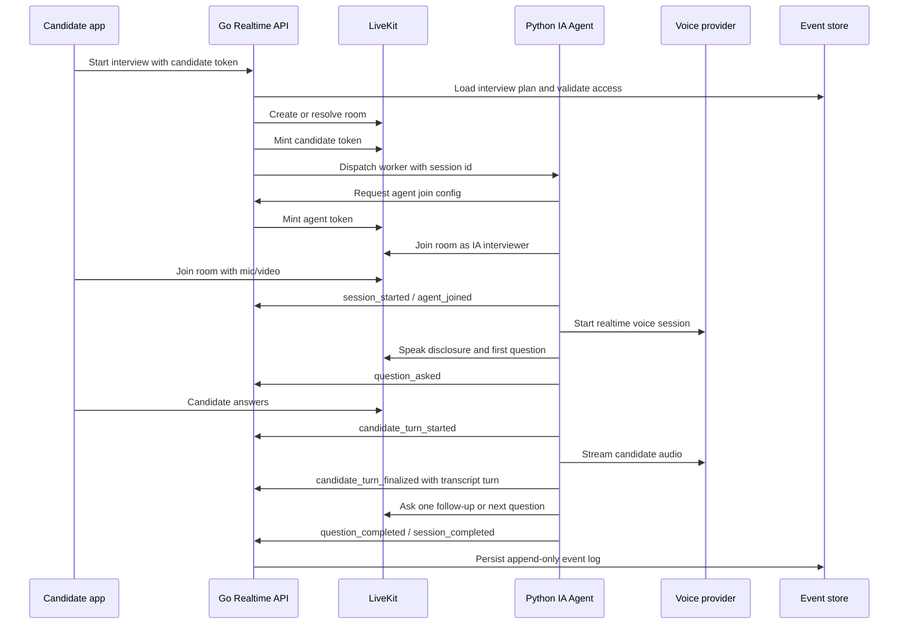
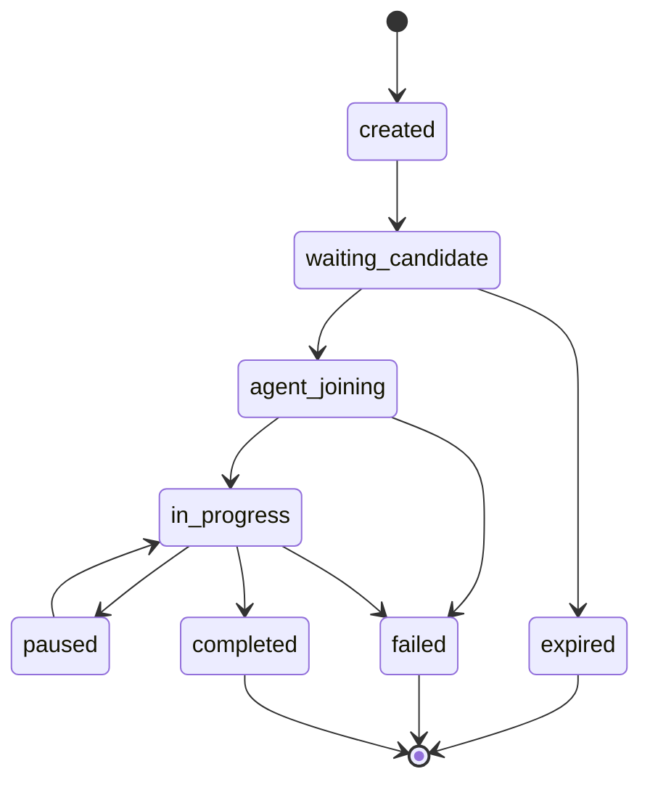

# Live IA Interviewer Architecture

## Context

Prelude's differentiator is a live IA interviewer for first-screen recruiting interviews. The product should feel like a structured, human-like interviewer, not a free-form chatbot and not only a generated form.

This POC keeps the architecture small while preserving boundaries that can survive a commercial pilot:

- Next.js apps for recruiter and candidate UX.
- Go Realtime API as the product control plane.
- LiveKit as the WebRTC/media plane.
- Python LiveKit Agent runtime as the IA interviewer worker.
- OpenAI Realtime as the primary voice provider.
- ElevenLabs as a voice quality benchmark and fallback candidate.

## Decision

Use **Go + LiveKit + Python** for the POC.

Go owns product orchestration and durable state. LiveKit owns realtime media. Python owns the IA interviewer loop because the voice-agent ecosystem is currently stronger there and iteration speed matters more than media-level control.

Do not build custom WebRTC in Go for the POC. That would move the main risk from interview quality to media infrastructure. If a future scale or compliance need requires owning the media gateway, the Go control plane can stay in place while the LiveKit boundary is replaced.

## System Boundaries

### Next.js Apps

Responsibilities:

- Collect recruiter interview configuration.
- Show candidate consent and IA disclosure.
- Request candidate mic/camera permissions.
- Join a LiveKit room with a short-lived token from the Go API.
- Render interview status, fallback states, and completion screens.

Non-goals:

- No provider secrets in the browser.
- No direct browser calls to OpenAI or ElevenLabs for the POC.
- No interview state authority in the browser.

### Go Realtime API

Responsibilities:

- Create live interview sessions.
- Validate candidate access tokens.
- Load the interview plan.
- Create or resolve LiveKit rooms.
- Mint short-lived LiveKit tokens for candidate and agent participants.
- Dispatch the Python interviewer worker.
- Ingest append-only session events.
- Persist transcript turns, provider metadata, status, and costs.
- Expose recruiter-facing session results.
- Enforce product permissions: video required, audio fallback allowed, form fallback allowed.

Non-goals:

- No direct WebRTC/RTP implementation in the POC.
- No provider-specific voice orchestration logic.
- No final hiring decision automation.

### LiveKit

Responsibilities:

- WebRTC room, audio, video, data channels, reconnect, TURN/STUN.
- Candidate and agent media exchange.
- Recording/egress hooks when enabled.

Non-goals:

- No hiring logic.
- No transcript authority.
- No business state authority.

### Python IA Interviewer Runtime

Responsibilities:

- Join the LiveKit room as the IA interviewer participant.
- Run the interviewer state machine.
- Use OpenAI Realtime for primary speech-to-speech behavior.
- Benchmark ElevenLabs voice quality on the same scripted plan.
- Respect turn-taking guardrails.
- Emit normalized events and transcript turns to the Go API.
- Keep provider adapters behind a small interface.

Non-goals:

- No durable business state outside local runtime memory.
- No recruiter dashboard API.
- No direct database writes in the POC.

## Runtime Flow

## Interviewer Behavior

The IA interviewer must be constrained. The product promise is a live first-screen interview, not an unconstrained assistant.

Business rules must be developed test-first. Before implementing Go or Python behavior, add focused tests for the rule being introduced: state transitions, one-follow-up limit, no-interruption behavior, candidate silence handling, forbidden-question filtering, event idempotency, and completion/failure outcomes.

Rules:

- Always disclose that the interviewer is IA.
- Be polite, calm, concise, and professional.
- Ask one question at a time.
- Never interrupt the candidate.
- Stop speaking when candidate barge-in is detected.
- Allow repeat, pause, and continue interactions.
- Use at most one contextual follow-up per planned question in the POC.
- Stay inside the approved interview plan.
- Never ask protected-class or legally sensitive questions.
- Never score appearance, emotion, accent, age, gender, ethnicity, disability, or family status.
- Produce recruiter summaries as decision support only; the recruiter remains responsible for decisions.

## State Machine

State transitions are business rules. They should be covered by tests before the Go control plane or Python runtime implementation accepts a new transition.

Session states:

- `created`: session exists but no candidate has joined.
- `waiting_candidate`: LiveKit room is ready and candidate token has been minted.
- `agent_joining`: agent worker has been dispatched and is joining the room.
- `in_progress`: agent and candidate are connected and interview events are flowing.
- `paused`: candidate or system pause.
- `completed`: closing message delivered or interview finished by policy.
- `failed`: unrecoverable error.
- `expired`: candidate did not start before expiry.

## Provider Strategy

Primary POC path:

- LiveKit for room/media.
- Python LiveKit Agents for the worker runtime.
- OpenAI Realtime for the first commercial POC.

Benchmark path:

- Run ElevenLabs against the same interview script and metrics.
- Compare naturalness, interruption behavior, latency, transcript quality, and cost.

Deferred:

- Pipecat remains an option if LiveKit Agents becomes too constraining.
- Custom Go WebRTC remains an option only after the product proves the live interview UX.

## Data And Observability

Measure from the first POC:

- `time_to_first_audio_ms`
- `end_of_speech_to_agent_audio_ms`
- `false_interrupt_count`
- `candidate_barge_in_success_count`
- `silence_recovery_count`
- `question_completion_rate`
- `interview_abandon_rate`
- `provider_error_count`
- `cost_estimate_cents`
- `candidate_rating`
- `recruiter_summary_rating`

Store:

- Append-only events.
- Final transcript turns.
- Question IDs and follow-up IDs.
- Provider metadata needed for debugging.
- Recording references when consent and settings allow recording.

## POC Acceptance Criteria

The commercial POC is acceptable when:

- A candidate can complete a 4 to 7 minute live audio interview.
- The IA asks 5 to 8 planned questions.
- The IA performs no more than one follow-up per question.
- Candidate barge-in stops IA speech reliably in manual testing.
- The transcript is sufficient to generate a recruiter summary.
- Failure modes are graceful for mic denial, agent timeout, provider error, and reconnect.
- The Go event log is the source of truth for session status and transcript state.
- Core business rules are covered by test-first unit or contract tests before implementation code is merged.

## Open Questions

- Do we require video for specific jobs, or keep video optional by default?
- Which provider gives the best French-language naturalness for recruiter-facing demos?
- Should recording be enabled in the first pilot or deferred until consent/legal copy is finalized?
- What minimum recruiter summary quality score qualifies the POC for commercial pilots?
