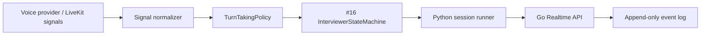

# Live IA Interviewer Turn-Taking Research

Issue: #17

## Decision

Do not make silence timeout or raw VAD the business authority for the live IA
interviewer.

Use a provider-neutral `TurnTakingPolicy` that consumes normalized runtime
signals and decides whether the interviewer may speak, must keep listening,
should repeat, should wait, should soft-reprompt, or must cancel/truncate agent
audio.

The provider emits signals. Prelude owns the interview behavior.

## Why This Matters

The product promise is a live first-screen interviewer that feels patient,
respectful, and structured. A simple endpointing rule like "speak after N ms of
silence" is too brittle for interviews because candidates pause, think, use
backchannels, ask for time, or interrupt because the agent misunderstood them.

Turn-taking has to protect two candidate-facing invariants:

- The IA interviewer does not talk over the candidate.
- The IA interviewer does not treat every noise, "mm-hmm", cough, or short
  overlap as a real interruption.

## Research Signals

- LiveKit Adaptive Interruption Handling says VAD-only interruption handling
  creates false barge-ins from backchannels, coughs, typing, background speech,
  and other non-interrupting audio. LiveKit's approach adds an interruption
  classifier on top of speech detection.
- LiveKit turn detection separates VAD from end-of-turn decisioning and
  recommends a turn detector model where possible.
- OpenAI Realtime exposes both `server_vad` and `semantic_vad`, plus explicit
  interruption/truncation behavior so the conversation state matches what the
  candidate actually heard.
- ElevenLabs exposes silence timeout, interruption, and turn eagerness controls;
  their docs warn that short timeouts feel responsive but can interrupt users
  who need time.
- Spoken-dialogue research consistently treats turn-taking as more than silence:
  acoustic cues, semantics, dialogue context, and interruption/backchannel
  classification all matter.

## Runtime Architecture

The provider adapter can expose LiveKit, OpenAI, or ElevenLabs details, but it
must normalize them before business policy sees them.

## Policy Rules

- The agent must not start speaking while `candidate_speaking` is true.
- If the candidate truly barges in while the agent is speaking, the agent audio
  is canceled or truncated and the session returns to listen/evaluate behavior.
- Backchannels and noise should be rejected as false barge-ins unless the
  provider has strong evidence of an actual interruption.
- End-of-turn should prefer semantic/acoustic completion signals; VAD-only
  stable silence is a fallback.
- Repeat requests repeat the same question without completing it or advancing.
- Wait requests extend patience and suppress immediate soft prompts.
- Silence is tiered: wait first, then a short soft prompt, then skip/pause only
  after a longer product rule.
- #16 still bounds the interview: no free chat, no extra question, one
  follow-up, and one soft reprompt per question for the POC.

## POC Timing Defaults

All values must be configuration, not hard-coded provider behavior.

- End-of-turn fallback: 700-1200 ms stable silence when no semantic/turn
  detector signal is available.
- True barge-in gate: 250-400 ms stable candidate speech plus non-backchannel
  classification before canceling agent audio.
- Soft prompt for candidate silence: 8-12 seconds.
- Explicit wait request: 20-30 seconds before checking in.
- Agent audio cancel latency target: p95 below 300 ms once real media is wired.

## Provider Settings

### LiveKit Agents

Use LiveKit's turn detector and Adaptive Interruption Handling when routing
voice through LiveKit Agents. Treat VAD-only mode as a degraded fallback.

Avoid running two competing end-of-turn authorities. If LiveKit owns turn
detection, OpenAI/ElevenLabs provider settings should not independently advance
Prelude's business state.

### OpenAI Realtime

Prefer `semantic_vad` for interview turns where candidate pacing matters.
Keep interruption handling enabled, and when the candidate interrupts during
agent audio, truncate/cancel the unplayed assistant audio so the model state
matches what the candidate heard.

### ElevenLabs

Use patient turn eagerness for interviews. Keep interruption handling available,
but do not make short silence timeouts the business rule for candidate silence.
Configure the soft prompt separately in Prelude policy.

## Events And Metrics

New normalized events for #17:

- `candidate_speech_started`
- `candidate_speech_stopped`
- `candidate_turn_detected`
- `agent_speech_started`
- `agent_speech_completed`
- `agent_speech_interrupted`
- `barge_in_detected`
- `barge_in_accepted`
- `barge_in_rejected`
- `backchannel_detected`
- `silence_timeout_started`
- `wait_requested`

Metrics these events support:

- `false_interrupt_rate`
- `candidate_barge_in_success_rate`
- `overtalk_duration_ms`
- `endpoint_latency_ms`
- `agent_audio_cancel_latency_ms`
- `backchannel_rejected_count`
- `wait_request_count`
- `silence_soft_prompt_count`
- `soft_prompt_recovery_rate`
- `time_to_first_audio_ms`

## Examples

### Normal Answer

1. `agent_speech_started`
2. `question_asked`
3. `agent_speech_completed`
4. `candidate_speech_started`
5. `candidate_speech_stopped`
6. `candidate_turn_detected`
7. `candidate_turn_finalized`

### Mid-Answer Pause

Candidate pauses briefly but semantic completion is false and stable silence is
below fallback threshold. Policy returns `keep_listening`; no final transcript
turn is emitted yet.

### Candidate Asks For Time

The turn is marked with `wait_requested`. Policy emits `wait_requested`, waits
longer, and does not immediately soft-prompt.

### True Barge-In

Candidate speech overlaps agent audio long enough and is classified as a real
interruption. Policy emits `barge_in_detected`, `barge_in_accepted`, and
`agent_speech_interrupted`; the runner cancels/truncates agent audio.

### Backchannel

Candidate says "mm-hmm" while the agent speaks. Policy emits
`backchannel_detected` and `barge_in_rejected`; the agent continues.

## Acceptance Tests

- Python deterministic policy tests cover normal turn, mid-question pause,
  incomplete answer, repeat request, wait request, true barge-in,
  backchannel/noise false barge-in, silence soft prompt, and no agent speech
  while candidate speaks.
- Python runner smoke can emit a mocked accepted barge-in and
  `agent_speech_interrupted`.
- Go accepts and persists the normalized #17 events with actor attribution.
- TypeScript contracts accept the frontend shape for the #17 events and reject
  sequence zero to match Go.
- Provider settings remain documented and switchable until #19 decides the
  commercial provider strategy.

## Sources

- https://livekit.com/blog/adaptive-interruption-handling
- https://docs.livekit.io/agents/logic/turns/
- https://docs.livekit.io/agents/logic/turns/turn-detector/
- https://developers.openai.com/api/docs/guides/realtime-vad
- https://developers.openai.com/api/docs/guides/realtime-conversations
- https://developers.openai.com/api/docs/guides/voice-agents
- https://openai.com/index/delivering-low-latency-voice-ai-at-scale/
- https://elevenlabs.io/docs/eleven-agents/customization/conversation-flow
- https://arxiv.org/abs/2501.08946
- https://aclanthology.org/W15-4606/
